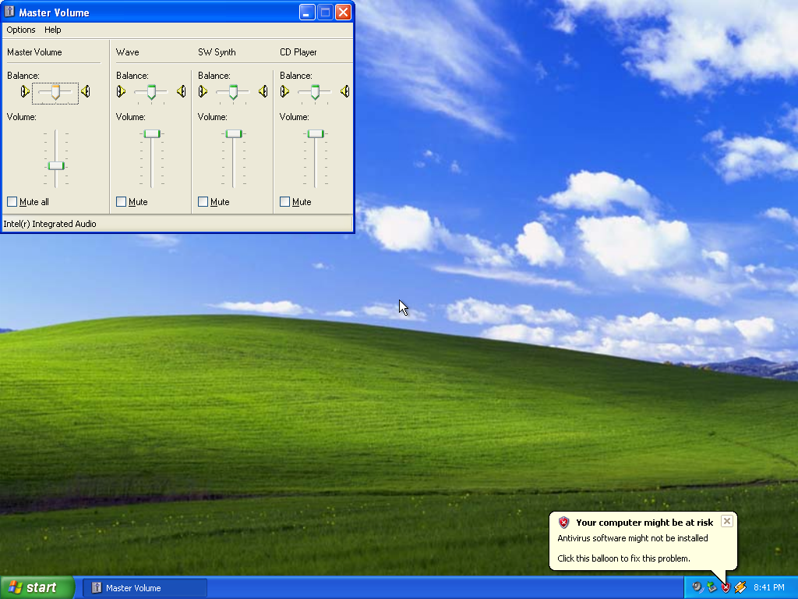
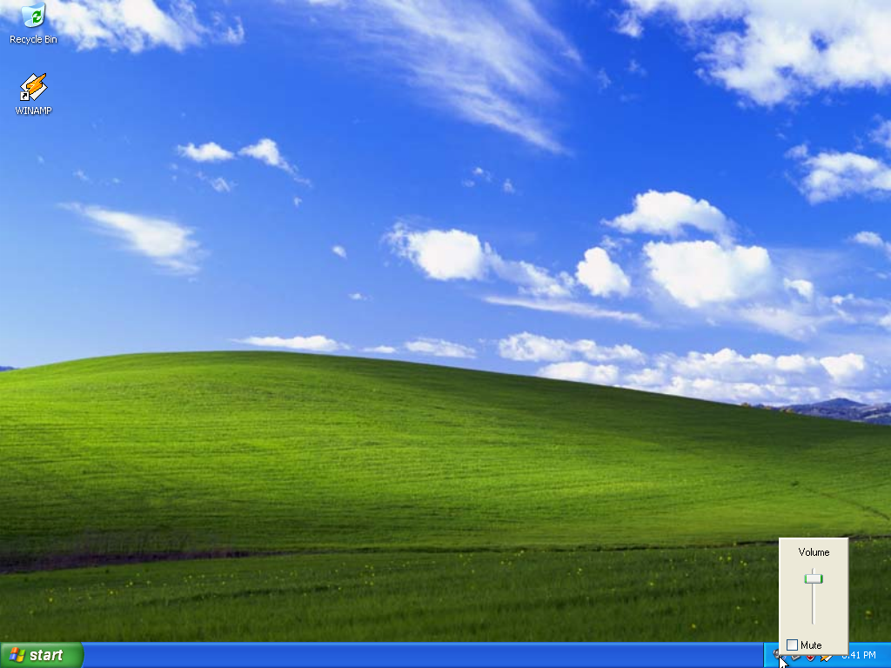

# XP reference VM audio

Verified on 2026-10-04 with QEMU 11.1.2 and the local XP SP3 base disk.
The base disk is local source media and is not stored in Git.

The VM exposes an AC97 sound card by default. XP's built-in Intel driver is
installed in the base disk and **Place volume icon in the taskbar** is enabled.
The default backend is silent. `--audio-output <file.wav>` records playback;
`--sound none` removes the sound card.

Checks performed:

- Shut down the writable guest normally, then cold-booted a new guest with
  temporary changes and the default Cirrus display adapter at 1024×768.
- Opened **Master Volume**, which identifies **Intel(r) Integrated Audio**.
- Moved the master slider and toggled **Mute all**. The tray icon changed
  with mute, and clicking it opened the volume popup.
- Recorded nonzero stereo PCM audio at 44,100 Hz. The controller finishes
  zero WAV length fields after QEMU exits, preserving the captured samples.
- Checked the base disk with `qemu-img check`.

Host speaker playback and microphone recording were not tested. The WAV
backend records output only.

